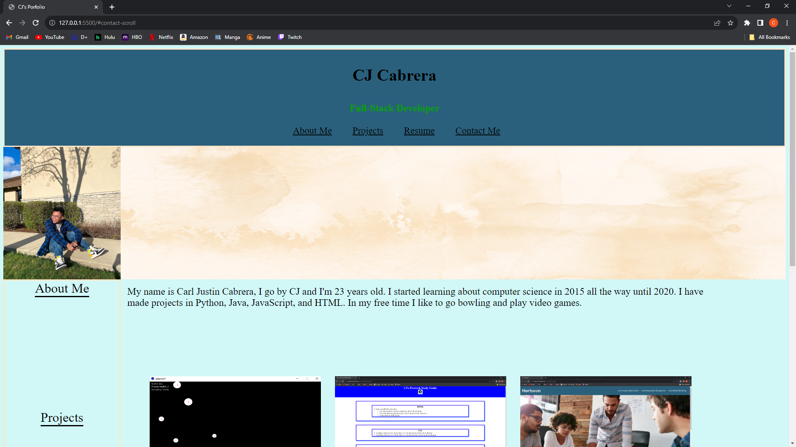

# PortfolioWebsite
In this project we had to create a website. The goal was to create a portfolio for future employer use. The site displays a short about me section as well as previous projects, work experience, and various ways to get into contact with me. This was all created with the combination of CSS and HTML.

## User Story

```
AS AN employer
I WANT to view a potential employee's deployed portfolio of work samples
SO THAT I can review samples of their work and assess whether they're a good candidate for an open position
```

## Usage
Upon landing on the page there will be four options you can click on, if you do not prefer to scroll down yourself. These options will take you to their respective sections of the website. Within the "Projects" section you will find three of my most recent projects and if you were to click on them you will be directed to a website where you can view the projects. On the bottom of the page you will find my email and two links that will guide you to their respective sites.

# Website Link
https://cjcabrera1.github.io/PortfolioWebsite/

this website should direct you to the landing page

